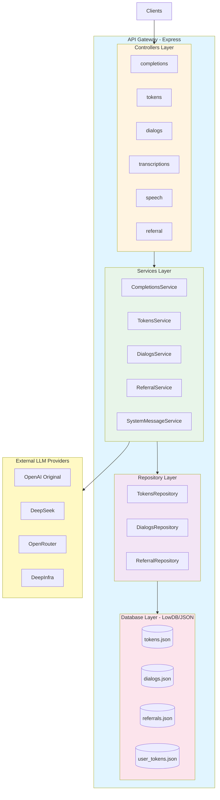
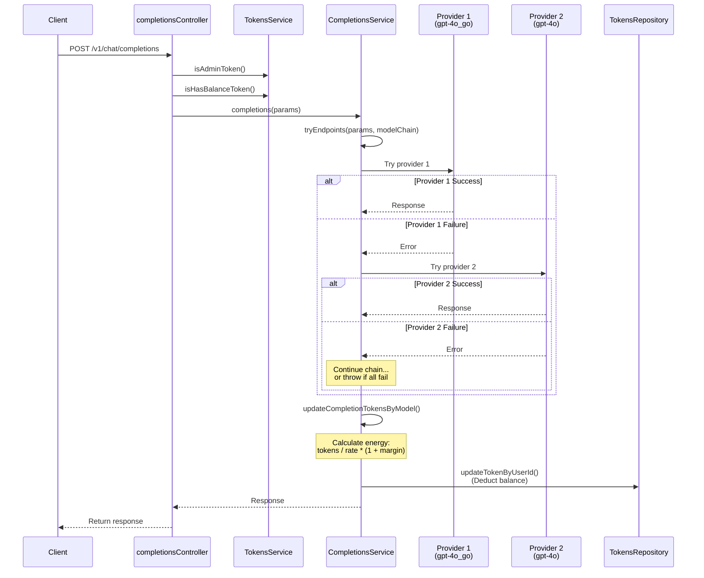
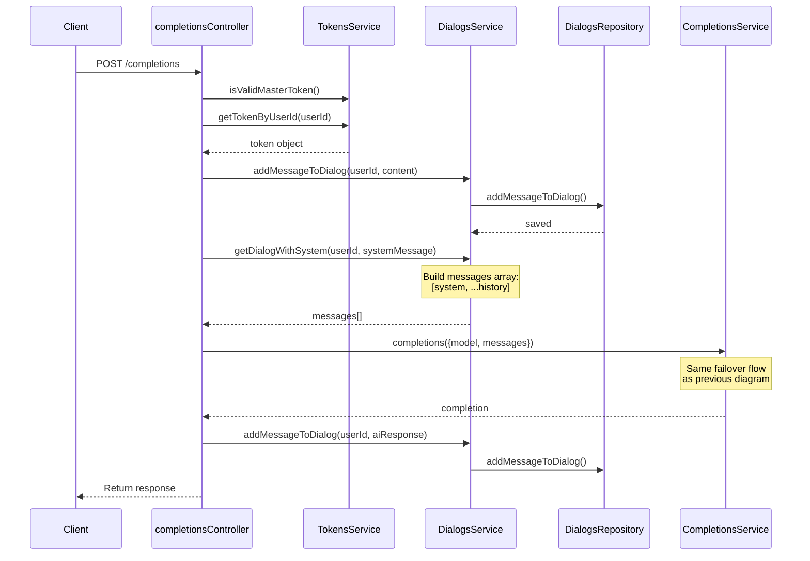

# API Gateway Architecture

## Overview

The API Gateway is a Node.js/Express-based microservice that serves as a proxy and management layer for multiple LLM (Large Language Model) providers. It provides unified API endpoints, token-based authentication, usage billing, and automatic failover between multiple AI service providers.

**Version**: 1.0.0
**License**: Unlicense (public domain)
**Runtime**: Node.js 18+
**Module System**: ES Modules (type: "module")

---

## System Architecture

### High-Level Architecture



---

## Directory Structure

```
api-gateway/
├── src/
│   ├── controllers/          # HTTP request handlers
│   │   ├── completionsController.js
│   │   ├── tokensController.js
│   │   ├── dialogsController.js
│   │   ├── transcriptionsController.js
│   │   ├── speechController.js
│   │   ├── systemMessagesController.js
│   │   └── referralController.js
│   ├── services/            # Business logic layer
│   │   ├── CompletionsService.js
│   │   ├── TokensService.js
│   │   ├── DialogsService.js
│   │   ├── ReferralService.js
│   │   ├── SystemMessageService.js
│   │   └── index.js
│   ├── repositories/        # Data access layer
│   │   ├── TokensRepository.js
│   │   ├── DialogsRepository.js
│   │   ├── ReferralRepository.js
│   │   ├── index.js
│   │   └── tests/
│   │       └── TokensRepository.test.js
│   ├── rest/               # HTTP response utilities
│   │   ├── rest.js         # Request wrapper
│   │   ├── HttpResponse.js # Standard HTTP response
│   │   ├── SSEResponse.js  # Server-Sent Events response
│   │   └── HttpException.js
│   ├── utils/              # Utility modules
│   │   ├── llmsConfig.js   # LLM provider configurations
│   │   └── dbManager.js    # Database management utilities
│   ├── db/                 # JSON database files
│   │   ├── tokens.json
│   │   ├── dialogs.json
│   │   ├── user_tokens.json
│   │   └── referrals.json
│   ├── logs/               # Application logs
│   │   └── server.*.log
│   ├── logger.js           # Pino logger configuration
│   └── server.js           # Application entry point
├── scripts/
│   ├── token-gen.js        # Token generation CLI
│   └── pull_update.js      # Update script
├── Dockerfile              # Container definition
├── package.json            # Dependencies & scripts
├── .prettierrc.js          # Code formatting config
└── README.md               # Documentation
```

---

## Core Components

### 1. Server Entry Point (`server.js`)

**Location**: `src/server.js`

**Responsibilities**:
- Express application initialization
- Middleware configuration (CORS, body-parser with 300MB limit)
- Controller routing
- Global error handling
- Server startup

**Key Features**:
- Large payload support (300MB) for audio/video processing
- CORS enabled for cross-origin requests
- Uncaught exception and unhandled rejection handlers

---

### 2. Controllers Layer

Controllers handle HTTP requests and delegate business logic to services. All controllers use the `rest()` wrapper for consistent error handling.

#### **completionsController.js**
- **Endpoints**:
  - `POST /v1/chat/completions` - OpenAI-compatible chat completions
  - `POST /completions` - Custom completions endpoint
- **Features**:
  - Streaming and non-streaming responses
  - Token validation and balance checking
  - Special handling for o1 and Claude models (convert streaming to non-streaming)
  - SSE (Server-Sent Events) support
  - Automatic failover between providers

#### **tokensController.js**
- **Endpoints**:
  - `GET /token` - Get user token
  - `GET /token/has` - Check if user has token
  - `PUT /token` - Update token balance
  - `POST /token` - Regenerate token
- **Authentication**: All endpoints require master token

#### **dialogsController.js**
- **Endpoints**:
  - `DELETE /dialog` - Clear dialog history
  - `GET /dialog` - Get dialog history
- **Features**: Maintains conversation context per user

#### **transcriptionsController.js**
- **Endpoints**:
  - `POST /v1/audio/transcriptions` - Audio-to-text transcription
- **Provider**: DeepInfra (Whisper model)
- **Features**:
  - Multer for file uploads
  - Token cost based on audio duration (15 tokens per second)
  - Model mapping (whisper-1 → openai/whisper-large-v3-turbo)

#### **speechController.js**
- **Endpoints**:
  - `POST /v1/audio/speech` - Text-to-speech synthesis
- **Provider**: OpenAI GoAPI
- **Features**:
  - Token cost calculation (0.5 tokens per character)
  - Audio file streaming
  - MP3 format output

#### **referralController.js**
- **Endpoints**:
  - `POST /referral` - Create referral relationship
  - `GET /referral` - Get referral count
- **Features**: Referral system for user acquisition tracking

---

### 3. Services Layer

Services contain business logic and orchestrate data access.

#### **CompletionsService**

**Key Methods**:
- `completions(params)` - Main completion orchestration
- `tryEndpoints(params, endpoints)` - Failover logic across providers
- `updateCompletionTokensByModel()` - Token accounting
- `processDialogHistory()` - Message processing for specific models
- `ensureCorrectMessageOrder()` - Validates message alternation

**Core Features**:
- **Automatic Failover**: Tries multiple endpoints until one succeeds
- **Provider Chain**: Configurable fallback sequences per model
- **Token Conversion**: Maps provider tokens to internal "energy" units
- **Profit Margin**: Applies 50% markup on token costs
- **Special Processing**: DeepSeek reasoner requires dialog history processing
- **Detailed Logging**: Request tracking with unique IDs

**Provider Retry Logic**:
```javascript
tryCompletionsConfig = {
  "gpt-4o": [
    "gpt-4o_go",      // Try GoAPI first
    "gpt-4o",         // Then official OpenAI
    "gpt-4o_guo",     // Then AiGuoGuo
    "deepseek-chat_openrouter",  // Then DeepSeek via OpenRouter
    "gpt-4o-mini_go", // Fallback to mini models
    // ... more fallbacks
  ]
}
```

#### **TokensService**

**Key Methods**:
- `isValidMasterToken()` - Validates admin access
- `isAdminToken()` - Validates user tokens
- `isHasBalanceToken()` - Checks token balance
- `getTokenById()`, `getTokenByUserId()` - Token retrieval
- `regenerateToken()` - Token rotation

**Security Features**:
- Bearer token extraction
- Master token validation (from `ADMIN_FIRST` env var)
- Balance enforcement (throws 429 on insufficient balance)
- Auto-initialization to 10,000 tokens for new users

#### **DialogsService**

**Key Methods**:
- `addMessageToDialog()` - Append user/assistant messages
- `getDialogWithSystem()` - Build message array with system prompt
- `clearDialog()` - Reset conversation history
- `findDialogById()` - Retrieve dialog by user ID

**Features**:
- System message injection (except for o1 models)
- Per-user conversation tracking
- Message history persistence

#### **ReferralService**

**Key Methods**:
- `createReferral()` - Establish referral relationship
- `getReferralCount()` - Count referrals per user

**Features**:
- Prevents self-referrals
- Token bonus distribution

---

### 4. Repository Layer

Repositories abstract data access using LowDB (JSON file storage).

#### **TokensRepository**

**Data Structure**:
```json
{
  "tokens": [
    {
      "id": "abc123...",        // 32-char hex token
      "user_id": "user_123",     // User identifier
      "tokens_gpt": 10000        // Energy balance
    }
  ]
}
```

**Methods**:
- `generateToken()` - Create new token with initial balance
- `getTokenById()`, `getTokenByUserId()` - Retrieval methods
- `updateTokenByUserId()` - Balance updates
- `hasUserToken()` - Existence check

#### **DialogsRepository**

**Data Structure**:
```json
{
  "dialogs": [
    {
      "name": "user_123",       // User ID
      "messages": [
        { "role": "system", "content": "..." },
        { "role": "user", "content": "..." },
        { "role": "assistant", "content": "..." }
      ]
    }
  ]
}
```

**Methods**:
- `addMessageToDialog()` - Append message
- `clearDialog()` - Reset conversation
- `findDialogById()` - Retrieve dialog

#### **ReferralRepository**

**Data Structure**:
```json
{
  "referrals": [
    {
      "referrer_id": "user_123",
      "referred_id": "user_456"
    }
  ]
}
```

---

### 5. REST Utilities

#### **rest.js**
Request wrapper that:
- Catches exceptions and converts to HTTP errors
- Handles `HttpResponse` objects
- Handles `SSEResponse` objects for streaming
- Provides consistent error responses

#### **HttpResponse**
Simple wrapper for standard HTTP responses:
```javascript
new HttpResponse(200, { data: "..." })
```

#### **SSEResponse**
Handles Server-Sent Events for streaming:
```javascript
new SSEResponse(async () => {
  res.write(SSEResponse.sendJSONEvent(chunk));
  res.write(SSEResponse.sendSSEEvent("[DONE]"));
  res.end();
});
```

#### **HttpException**
Custom error class with HTTP status codes:
```javascript
throw new HttpException(401, "Invalid token");
```

---

### 6. LLM Configuration (`llmsConfig.js`)

Defines all supported LLM providers and models.

**Supported Providers**:
- **OpenAI Original**: Official OpenAI API
- **OpenAI GoAPI**: Alternative OpenAI gateway
- **OpenAI Opensource**: Open-source models via custom endpoint
- **AiGuoGuo**: Third-party OpenAI gateway
- **DeepSeek**: DeepSeek official API
- **OpenRouter**: Multi-provider aggregator

**Model Configuration**:
```javascript
{
  "gpt-4o": {
    modelName: "gpt-4o",
    endpoint: openai_original,
    convertationEnergy: 1.2  // 1 token = 1.2 energy units
  }
}
```

**Supported Models** (46 total):
- GPT-4o variants (official, go, guo)
- GPT-4o-mini variants
- GPT-3.5-turbo variants
- o1-preview, o1-mini, o3-mini
- Claude 3.5 Sonnet, Haiku, Opus
- Claude 3.7 Sonnet, Sonnet 4
- GPT-4.1, 4.1-mini, 4.1-nano (custom)
- DeepSeek Chat, DeepSeek Reasoner
- Meta Llama 3.1 (8B, 70B, 405B)
- WizardLM-2 variants
- Uncensored models

**Energy Conversion Rates**:
- High-tier reasoning (o1-preview, Claude Opus): 0.12-0.2
- Mid-tier (GPT-4o, Claude Sonnet): 0.8-1.2
- Efficient (Claude Haiku, GPT-4o-mini): 2.4-20
- Open-source (Llama, WizardLM): 1.7-40

---

### 7. Database Manager (`dbManager.js`)

Legacy utility for file-based database operations (mostly superseded by repositories).

**Functions**:
- `initializeFiles()` - Create initial JSON files
- `generateUserToken()`, `generateAdminToken()` - Token creation
- `addNewMessage()`, `addNewDialogs()` - Dialog management
- `deleteFirstMessage()` - Context window management
- `clearDialog()` - Reset conversation
- `isValidAdminToken()`, `isValidUserToken()` - Authentication

**Database Files**:
- `src/db/tokens.json` - Admin tokens
- `src/db/user_tokens.json` - User tokens
- `src/db/dialogs.json` - Conversation history
- `src/db/referrals.json` - Referral relationships

---

### 8. Logger (`logger.js`)

**Library**: Pino + pino-roll

**Configuration**:
- Dual output: console (STDOUT) and file
- Daily rotation with 7-day retention
- 20MB size limit per file
- Format: `server.YYYY-MM-DD.N.log`
- Directory: `src/logs/`

**Features**:
- High-performance JSON logging
- Automatic log rotation
- Structured logging support

---

## API Endpoints

### Completions

#### `POST /v1/chat/completions`
OpenAI-compatible chat completions endpoint.

**Authentication**: Bearer token (admin token)

**Request Body**:
```json
{
  "model": "gpt-4o",
  "messages": [
    { "role": "system", "content": "You are a helpful assistant." },
    { "role": "user", "content": "Hello!" }
  ],
  "stream": false,
  "temperature": 0.7
}
```

**Response** (non-streaming):
```json
{
  "id": "chatcmpl-123",
  "object": "chat.completion",
  "created": 1677652288,
  "model": "gpt-4o",
  "choices": [{
    "index": 0,
    "message": {
      "role": "assistant",
      "content": "Hello! How can I help you today?"
    },
    "finish_reason": "stop"
  }],
  "usage": {
    "prompt_tokens": 12,
    "completion_tokens": 9,
    "total_tokens": 21,
    "energy": 15.75  // Custom field
  }
}
```

**Response** (streaming):
Server-Sent Events stream:
```
data: {"id":"chatcmpl-123","choices":[{"delta":{"role":"assistant"},"index":0}],...}

data: {"id":"chatcmpl-123","choices":[{"delta":{"content":"Hello"},"index":0}],...}

data: {"id":"chatcmpl-123","choices":[{"delta":{},"finish_reason":"stop","index":0}],...}

data: {"id":"chatcmpl-123","usage":{"total_tokens":21,"energy":15.75},...}

data: [DONE]
```

**Special Behavior**:
- o1/Claude models: Always converted to non-streaming internally
- Automatic provider failover on errors
- Token balance deducted after successful completion

#### `POST /completions`
Custom completions endpoint with dialog management.

**Authentication**: Query parameter `?masterToken=...`

**Request Body**:
```json
{
  "model": "gpt-4o",
  "content": "What is the weather?",
  "systemMessage": "You are a weather assistant.",
  "userId": "user_123"
}
```

**Features**:
- Automatic dialog history management
- System message injection
- User token lookup
- Response added to dialog automatically

---

### Tokens

#### `GET /token?masterToken=...&userId=...`
Retrieve user token information.

**Response**:
```json
{
  "id": "abc123...",
  "user_id": "user_123",
  "tokens_gpt": 8500
}
```

#### `GET /token/has?masterToken=...&userId=...`
Check if user has a token.

**Response**:
```json
{
  "hasUser": true
}
```

#### `PUT /token?masterToken=...&userId=...`
Update token balance.

**Request Body**:
```json
{
  "operation": "add",  // or "subtract"
  "amount": 1000
}
```

#### `POST /token?masterToken=...&userId=...`
Regenerate user token (security measure).

---

### Dialogs

#### `DELETE /dialog?masterToken=...&userId=...`
Clear user's conversation history.

**Response**:
```json
{
  "cleared": true
}
```

#### `GET /dialog?masterToken=...&userId=...`
Retrieve user's dialog history.

**Response**:
```json
{
  "name": "user_123",
  "messages": [
    { "role": "user", "content": "Hello" },
    { "role": "assistant", "content": "Hi there!" }
  ]
}
```

---

### Audio

#### `POST /v1/audio/transcriptions`
Transcribe audio to text (OpenAI Whisper-compatible).

**Authentication**: Bearer token

**Request**: multipart/form-data
- `file`: Audio file (mp3, wav, etc.)
- `model`: "whisper-1"
- `language`: "en" (optional)

**Response**:
```json
{
  "text": "Hello, this is a transcription.",
  "duration": 3.5,
  "language": "en"
}
```

**Pricing**: 15 tokens per second of audio (rounded up)

#### `POST /v1/audio/speech`
Generate speech from text (OpenAI TTS-compatible).

**Authentication**: Bearer token

**Request Body**:
```json
{
  "model": "tts-1",
  "input": "Hello world",
  "voice": "alloy"
}
```

**Response**: Binary audio stream (audio/mpeg)

**Headers**:
- `Content-Type: audio/mpeg`
- `Content-Disposition: attachment; filename="speech.mp3"`
- `X-Token-Cost: 6` (cost in tokens)

**Pricing**: 0.5 tokens per character

---

### Referrals

#### `POST /referral?masterToken=...`
Create referral relationship.

**Request Body**:
```json
{
  "referrerId": "user_123",
  "referredId": "user_456"
}
```

#### `GET /referral?masterToken=...&userId=...`
Get referral count for user.

**Response**:
```json
{
  "count": 5
}
```

---

## Data Flow

### 1. Chat Completion Flow



### 2. Dialog-based Completion Flow



### 3. Token Management Flow

```mermaid
flowchart TD
    A[New User Request] --> B[TokensService.getTokenByUserId]
    B --> C[TokensRepository.getTokenByUserId]
    C --> D{Token<br/>Found?}
    D -->|Yes| E[Return existing token]
    D -->|No| F[TokensRepository.generateToken]
    F --> G[Generate crypto-random<br/>32-char hex ID]
    G --> H[Create token object:<br/>{id, user_id, tokens_gpt: 10000}]
    H --> I[Save to tokens.json]
    I --> J[Return token object]

    style D fill:#fff4e1
    style F fill:#e8f5e9
    style G fill:#e1f5ff
```

---

## Configuration

### Environment Variables

**Required**:
- `PORT` - Server port (default: 8088)
- `ADMIN_FIRST` - Master token for admin operations

**OpenAI Original**:
- `OPENAI_ORIGINAL_API_KEY`
- `OPENAI_ORIGINAL_BASE_URL`

**OpenAI GoAPI**:
- `OPENAI_API_KEY`
- `OPENAI_BASE_URL`

**OpenAI Opensource**:
- `FREE_OPENAI_KEY`
- `FREE_OPENAI_BASE_URL`

**AiGuoGuo**:
- `AIGUOGUO_API_KEY`
- `AIGUOGUO_BASE_URL`

**DeepSeek**:
- `DEEPSEEK_API_KEY`
- `DEEPSEEK_BASE_URL`

**OpenRouter**:
- `OPENROUTER_API_KEY`
- `OPENROUTER_BASE_URL`

**GraphQL (Legacy)**:
- `GQL_URN`
- `GQL_SSL`
- `GQL_TOKEN`
- `SPACE_ID_ARGUMENT`

---

## Deployment

### Docker

**Dockerfile** (Node 18-based):
```dockerfile
FROM node:18
WORKDIR /usr/src/app
COPY package*.json ./
RUN npm install
COPY . .
EXPOSE 8088
CMD ["npm", "start"]
```

**Build**:
```bash
docker build -t api-gateway .
```

**Run**:
```bash
docker run -d \
  -p 8088:8088 \
  -v ./src/db:/usr/src/app/src/db \
  -e PORT=8088 \
  -e ADMIN_FIRST=your_master_token \
  -e OPENAI_API_KEY=sk-... \
  --name api-gateway \
  api-gateway
```

### Docker Compose

```yaml
version: '3.8'
services:
  api-gateway:
    build: .
    container_name: api-gateway
    ports:
      - "8088:8088"
    volumes:
      - ./src/db:/usr/src/app/src/db
    environment:
      - PORT=8088
      - ADMIN_FIRST=${ADMIN_FIRST}
      - OPENAI_API_KEY=${OPENAI_API_KEY}
      - OPENAI_BASE_URL=${OPENAI_BASE_URL}
      # ... other env vars
    restart: unless-stopped
```

---

## Token Economy

### Energy Conversion System

The gateway uses an internal "energy" currency to normalize costs across providers.

**Formula**:
```
energy = (provider_tokens / conversion_rate) * (1 + profit_margin)
```

**Example** (GPT-4o):
- Provider tokens: 1000
- Conversion rate: 1.2
- Profit margin: 50%
- Energy cost: (1000 / 1.2) * 1.5 = 1250 energy units

**Conversion Rates by Tier**:
- **Premium Reasoning** (0.12-0.2): o1-preview, Claude Opus
- **High-Performance** (0.8-1.2): GPT-4o, Claude Sonnet, DeepSeek Reasoner
- **Efficient** (2.4-20): GPT-4o-mini, Claude Haiku, o1-mini
- **Open Source** (1.7-40): Llama 3.1, WizardLM-2

**Special Cases**:
- Audio transcription: 15 energy/second
- Text-to-speech: 0.5 energy/character
- Bonus account (user_id "666"): Free tier if balance > 100k

---

## Error Handling

### HTTP Status Codes

- **200** - Success
- **400** - Bad request (missing parameters)
- **401** - Unauthorized (invalid token)
- **429** - Insufficient balance
- **500** - Server error / All providers unavailable

### Error Response Format

```json
{
  "error": "Error message",
  "message": "Detailed description",
  "status": "error"
}
```

### Failover Behavior

When a provider fails:
1. Log error with details (provider, model, error type)
2. Try next provider in chain
3. If all providers fail, return aggregated error:
```json
{
  "error": "All providers unavailable: Rate limit exceeded, API key expired, ...",
  "message": "...",
  "status": "error"
}
```

### Global Error Handlers

```javascript
process.on('uncaughtException', (err) => {
  console.error('[UNCAUGHT EXCEPTION]', err);
});

process.on('unhandledRejection', (reason, promise) => {
  console.error('[UNHANDLED REJECTION]', reason);
});
```

---

## Logging

### Log Levels

Pino supports standard log levels, but the codebase primarily uses `console.log()` for compatibility.

### Log Format

**Request Tracking**:
```
[abc123] 🚀 Starting connection attempts to providers for model gpt-4o
[abc123] 📋 Available endpoints: [gpt-4o_go, gpt-4o, ...]
[abc123] 🔄 Attempt 1/5: gpt-4o_go → gpt-4o (api.goapi.ai)
[abc123] 💬 User message: "Hello world..."
[abc123] ✅ Successful response from api.goapi.ai in 1234ms
```

**Token Operations**:
```
[ запрос на токен abc123... ]
[ проверка админ токена abc123... пройдена ]
[ проверка баланса у пользователя abc123... проверка пройдена. баланс: 8500]
```

**Dialog Operations**:
```
[ добавление нового сообщения в диалог user_123 ]
[ новое сообщение добавлено в диалог user_123 ]
```

### Log Rotation

- **Daily rotation** at midnight
- **7-day retention** (automatic deletion of older logs)
- **20MB size limit** per file
- **Location**: `src/logs/server.YYYY-MM-DD.N.log`

---

## Security Considerations

### Authentication

1. **Master Token** (`ADMIN_FIRST` env var):
   - Required for all admin operations
   - Token management endpoints
   - Dialog management endpoints
   - Referral operations

2. **User Tokens**:
   - 32-character hex strings (crypto-random)
   - Used as Bearer tokens
   - Validated against `tokens.json`
   - Can be regenerated for security

### Token Rotation

```bash
# Using CLI
node scripts/token-gen.js --type admin --token 15000

# Via API
POST /token?masterToken=...&userId=user_123
```

### Rate Limiting

- Balance-based throttling (no rate limits, but balance must be positive)
- 429 status when balance insufficient
- No request-per-second limits (relies on balance depletion)

### Data Storage

- JSON files are stored in `src/db/`
- **No encryption at rest** (consider encrypting volume in production)
- **No PII validation** (consider adding GDPR compliance)
- **Single-threaded writes** (LowDB handles concurrency)

### CORS

- **Wide open**: `cors()` middleware with default settings
- Allows all origins (consider restricting in production)

---

## Performance Characteristics

### Concurrency

- **Single process** (no clustering by default)
- **Async I/O** (non-blocking via async/await)
- **Streaming support** for long completions
- **LowDB locking** (JSON file access is serialized)

### Timeouts

- **Completions**: 50-180 seconds (varies by provider)
- **TTS**: 30 seconds
- **Transcription**: Default fetch timeout
- **Body parser**: No timeout (300MB limit)

### Resource Limits

- **Body size**: 300MB (for large audio files)
- **Concurrent connections**: Limited by Node.js/OS
- **Database**: In-memory + file-persisted (scales to ~10k users)

### Optimization Opportunities

1. **Database**: Migrate to [links-notation](https://github.com/link-foundation/links-notation) (file-based human-readable) or [link-cli](https://github.com/link-foundation/link-cli) (binary file database with high efficiency) for > 10k users
2. **Caching**: Add Redis for token lookups
3. **Clustering**: Use PM2 or k8s for horizontal scaling
4. **Rate Limiting**: Add Redis-backed rate limiter
5. **Queue System**: Offload long completions to queue (Bull/BullMQ)

---

## Testing

### Test Files

- `src/repositories/tests/TokensRepository.test.js`

### Test Framework

- **Vitest** (configured in package.json)
- **Babel + Jest** (legacy support)

### Running Tests

```bash
npm run vitest
```

### Test Coverage

Currently minimal - only TokensRepository has tests.

**Recommended additions**:
- Unit tests for all services
- Integration tests for controllers
- E2E tests for critical flows
- Load testing for failover logic

---

## Development

### Scripts

```bash
# Start server
npm start

# Run tests
npm run vitest

# Format code
npm run format

# Generate admin token
npm run generate-token -- --type admin --token 15000

# Generate user token
npm run generate-token -- --type user --userName john --token 5000

# Pull updates (custom script)
npm run pull_update
```

### Code Style

- **Prettier** configured (`.prettierrc.js`)
- **ES Modules** (import/export syntax)
- **No semicolons** (Prettier default)
- **2-space indentation**

### Adding a New Model

1. Add provider client in `llmsConfig.js`:
```javascript
const newProvider = new OpenAI({
  apiKey: process.env.NEW_PROVIDER_KEY,
  baseURL: process.env.NEW_PROVIDER_URL,
  timeout: 60000
});
```

2. Add model config:
```javascript
"new-model": {
  modelName: "actual-model-name",
  endpoint: newProvider,
  convertationEnergy: 2.0
}
```

3. Add to retry chain in `tryCompletionsConfig`:
```javascript
"new-model": [
  "new-model",
  "gpt-4o",  // Fallback
  // ...
]
```

### Adding a New Endpoint

1. Create controller in `src/controllers/`:
```javascript
import express from "express";
import { rest } from "../rest/rest.js";
import { HttpResponse } from "../rest/HttpResponse.js";

const myController = express.Router();

myController.get("/my-endpoint", rest(async ({ req }) => {
  // Logic here
  return new HttpResponse(200, { data: "..." });
}));

export default myController;
```

2. Register in `src/server.js`:
```javascript
import myController from "./controllers/myController.js";
app.use("/", myController);
```

---

## Dependencies

### Production

- **express** (4.18.1) - Web framework
- **body-parser** (1.20.0) - Request parsing
- **cors** (2.8.5) - CORS middleware
- **openai** (4.63.0) - OpenAI SDK (also works for compatible APIs)
- **axios** (0.27.2) - HTTP client
- **lowdb** (7.0.1) - JSON database
- **pino** (9.6.0) - Logger
- **pino-roll** (3.0.0) - Log rotation
- **multer** (1.4.5-lts.1) - File upload handling
- **form-data** (4.0.0) - Multipart form construction
- **node-fetch** (3.3.2) - Fetch API
- **uuid** (10.0.0) - UUID generation
- **yargs** (17.5.1) - CLI argument parsing
- **cron** (3.1.7) - Scheduled tasks
- **dotenv** (16.0.1) - Environment variables
- **deepinfra** (2.0.2) - DeepInfra SDK
- **@google/generative-ai** (0.20.0) - Google AI SDK (unused?)
- **stream-mime-type** (2.0.0) - MIME detection

### Development

- **prettier** (3.3.3) - Code formatter
- **vitest** (2.1.3) - Test runner
- **jest** (29.7.0) - Test framework
- **babel-jest** (29.7.0) - Babel integration
- **@babel/preset-env** (7.25.8) - Babel presets
- **babel-plugin-transform-import-meta** (2.2.1) - Import meta transform

---

## Known Issues & TODOs

### TODOs in Code

1. **completionsController.js:11** - "рефакторинг" (refactoring needed)
2. **Token cost calculation** - Hardcoded values for TTS/transcription
3. **Error messages** - Mix of Russian and English
4. **GraphQL integration** - Appears unused (GQL env vars present)
5. **dbManager.js** - Legacy code still in use, should migrate fully to repositories

### Potential Issues

1. **Concurrency**: JSON file writes may conflict under high load
2. **Error Leakage**: Some provider errors exposed to clients
3. **No Request IDs**: Difficult to trace requests across logs (partially implemented)
4. **Hardcoded Profit Margin**: 50% markup is not configurable
5. **No Health Checks**: No `/health` endpoint for monitoring
6. **Large Payload Risk**: 300MB limit may cause memory issues

### Recommended Improvements

1. Add proper health/readiness endpoints
2. Implement request ID middleware
3. Migrate to PostgreSQL for production
4. Add Prometheus metrics
5. Implement circuit breaker pattern for providers
6. Add comprehensive test coverage
7. Standardize logging (remove console.log, use Pino everywhere)
8. Add API versioning strategy
9. Implement proper API documentation (OpenAPI/Swagger)
10. Add monitoring/alerting for provider failures

---

## Troubleshooting

### Common Issues

**1. "Невалидный мастер токен" (Invalid master token)**
- Check `ADMIN_FIRST` environment variable
- Ensure masterToken query parameter matches

**2. "Не хватает баланса" (Insufficient balance)**
- Check user token balance: `GET /token?masterToken=...&userId=...`
- Top up balance: `PUT /token` with operation="add"

**3. All providers unavailable**
- Check provider API keys in environment variables
- Check network connectivity to provider endpoints
- Review logs for specific provider errors
- Verify provider account status/quotas

**4. Logs not rotating**
- Check `src/logs/` directory exists and is writable
- Verify pino-roll configuration
- Check disk space

**5. Audio transcription failing**
- Verify file format (mp3, wav, m4a supported)
- Check file size (under 300MB)
- Ensure DeepInfra API key is valid

---

## Glossary

- **Energy**: Internal currency unit (normalized from provider tokens)
- **Conversion Rate**: Ratio of provider tokens to energy units
- **Profit Margin**: Markup applied to energy costs (default 50%)
- **Master Token**: Admin authentication token
- **User Token**: Bearer token for API access
- **Dialog**: Conversation history per user
- **Completion**: LLM response generation
- **SSE**: Server-Sent Events (streaming protocol)
- **Failover**: Automatic provider switching on errors
- **Provider Chain**: Ordered list of providers to try

---

## License

This software is released into the **public domain** under the [Unlicense](https://unlicense.org).

**Important**: The Unlicense is NOT the same as having no license or being "unlicensed". The Unlicense is a specific public domain dedication that explicitly grants everyone the freedom to use, modify, and distribute this software without restrictions.

Anyone is free to copy, modify, publish, use, compile, sell, or distribute this software, either in source code form or as a compiled binary, for any purpose, commercial or non-commercial, and by any means.

For the full license text, see the [LICENSE](LICENSE) file or visit [unlicense.org](https://unlicense.org).

---

## Contributors

Deep.Assistant Team

---

## Architecture Diagram (Detailed)

```mermaid
graph TB
    subgraph ClientLayer[Client Layer]
        WebApp[Web App]
        MobileApp[Mobile App]
        CLI[CLI Tool]
        ExternalAPI[External API]
    end

    subgraph Middleware[Express.js Middleware]
        CORS[CORS - allow all]
        BodyParser[body-parser - 300MB limit]
        Logger[Logger - Pino]
    end

    subgraph Controllers[Controllers Layer]
        CompController[Completions Controller]
        TokenController[Tokens Controller]
        DialogController[Dialogs Controller]
    end

    subgraph RestWrapper[rest - Wrapper]
        ExceptionHandler[Exception handling]
        ResponseRouter[HttpResponse/SSEResponse routing]
        ErrorFormatter[Consistent error formatting]
    end

    subgraph Services[Services Layer]
        CompService[CompletionsService<br/>• tryEndpoints<br/>• completions<br/>• updateTokens]
        TokenService[TokensService<br/>• isAdminToken<br/>• hasBalance<br/>• getToken]
        DialogService[DialogsService<br/>• getDialog<br/>• addMessage<br/>• clearDialog]
    end

    subgraph Repositories[Repository Layer]
        TokenRepo[Tokens Repository]
        DialogRepo[Dialogs Repository]
    end

    subgraph Database[LowDB - JSON Database]
        TokensDB[(tokens.json<br/>{tokens:[]})]
        DialogsDB[(dialogs.json<br/>{dialogs:[]})]
        FileSystem[File System: src/db/]
    end

    subgraph FailoverChain[LLM Provider Failover Chain]
        P1[Provider 1: gpt-4o_go]
        P2[Provider 2: gpt-4o]
        P3[Provider 3: gpt-4o_guo]
        P4[Provider 4: deepseek]
    end

    subgraph ExternalProviders[External API Providers]
        OpenAI[OpenAI Official]
        DeepSeek[DeepSeek]
        OpenRouter[OpenRouter]
        DeepInfra[DeepInfra]
    end

    ClientLayer -->|HTTP/HTTPS REST| Middleware
    Middleware --> Controllers
    Controllers --> RestWrapper
    RestWrapper --> Services
    Services --> Repositories
    Repositories --> Database
    Database -.->|File I/O| FileSystem

    Services --> FailoverChain
    P1 -->|Fail| P2
    P2 -->|Fail| P3
    P3 -->|Fail| P4
    P4 -->|Success| Services

    FailoverChain --> ExternalProviders
    TokenService -.->|uses| CompService

    style ClientLayer fill:#e3f2fd
    style Middleware fill:#fff3e0
    style Controllers fill:#e8f5e9
    style RestWrapper fill:#fce4ec
    style Services fill:#f3e5f5
    style Repositories fill:#e0f2f1
    style Database fill:#fff9c4
    style FailoverChain fill:#ffe0b2
    style ExternalProviders fill:#f1f8e9
```

---

*Document generated: 2025-10-25*
*Version: 1.0.0*
